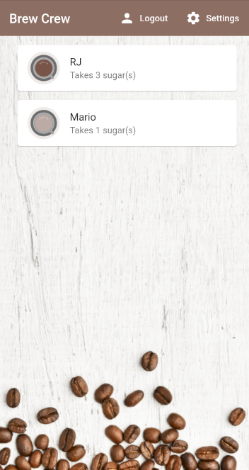
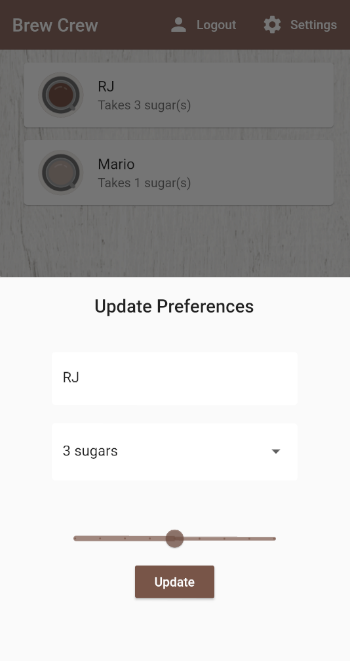

# Brew Crew

 

 

## Flutter App based on [The Net Ninja](https://github.com/iamshaunjp)'s Flutter & Firebase course.

 
 

&nbsp;&nbsp;

 
 

---

## Contributing

We'd love to accept your patches and contributions to this project. There are just a few guidelines you need to follow.

### [Code of Conduct](./CODE_OF_CONDUCT.md)

This project follows [Contributor Covenant](https://www.contributor-covenant.org/)
as it's Code of Conduct, and we expect all project participants to adhere to it.
Please read the [full guide](./CODE_OF_CONDUCT.md) so that you can understand
what actions will not be tolerated.

### [Contributing Guide](./CONTRIBUTING.md)

Read our [contributing guide](./CONTRIBUTING.md) to learn about our development process, how to propose bugfixes and improvements, and how to build and test your changes to project.

### [LICENSE](./LICENSE)

This project is licensed under the [MIT License](./LICENSE), meaning that you're free to modify, distribute, and / or use it for any commercial or private project.
